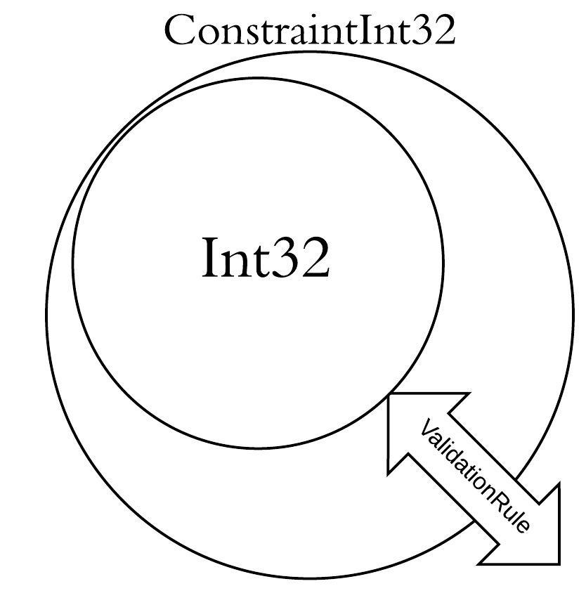

- title :  Value constraint at compile-time
- description : Value constraint at compile-time
- author : Fahd Abdeljallal
- theme : sky
- transition : default

##  Value constraint at compile-time

> **By** Fahd Abdeljallal

***

### What led me up to do this project ?

***

### Introduction

* Extension of [DependentTypesProvider](https://github.com/caindy/DependentTypesProvider)
* Avoid incoherency in values both at compile and run-time
* Hide boilerplate

***

### Background -- Type Provider (TP)

* Compiler extension
* Grasp data from the outside world
* Traverse the data in a type-safe manner, interactively

***

### Why constraint in a TP?

* Give meaning to a basic type, like:

        type Probability = Probability of float

* Have a set which follows a specific rule

***

### The extension

* Upper, Lower Constraint
* Done only at runtime
* Basic F# types

***

### The extension : Upper, Lower Constraint (1)

* Any constraint with generic rule
* Fsi integrated takes string representation of a function of type

        'a -> bool

* Example

        let f (x:int) = 
            x % 5 = 0 

***

### The extension : Upper, Lower Constraint (2)

* Basic type has a validation rule inside himself

***

### The extension : Done only at runtime

* Compile-time constraint
* Static method
        
        type MultipleOf5 = Constraint.Numbers.ConstraintInt32<SomeValidationRule>
        let aValueFollowingTheRule = 5
        let value = MultipleOf5.Create<aValueFollowingTheRule>()

* Problem : Only working with Literals / Basic F# types

***

### The extension : Basic F# types at compile-time

* How about arrays/list ...?
* static method + string representation + Fsi integrated

        type Constraint = Constraint.ArrayOfNumber.ConstraintByteArray<Rule>
        let aValueFollowingTheRule = "[|5uy;6uy;7uy|]"
        let value = Constraint.Create<aValueFollowingTheRule>()

* string representation = type-checked at compile-time

***

### Constraint little world

* Provided Type world = secured by a validation system

        let rule = "let f (x:float) = x<>0. \nf"
        type NotZero = Constraint.Numbers.ConstraintDouble<rule>

        let divide (aFloat:float) (nonZeroFloat:NotZero) =
            aFloat / nonZeroFloat.RawValue

        let floatFromExternal = getFloatExternal()
        let maybeNotZeroFloat = NotZero.TryCreate(floatFromExternal)

        match maybeNotZeroFloat with
        |None -> // Do whatever : can't call divide function

        // This is going to be safe, Normally :D 
        |Some nonZeroFloat -> divide 5 nonZeroFloat

        
***

### Demo

***

### What's next?

* Add some other types if needed
* Operations between these types ?

***
### Question
    

   Any Questions ?

***